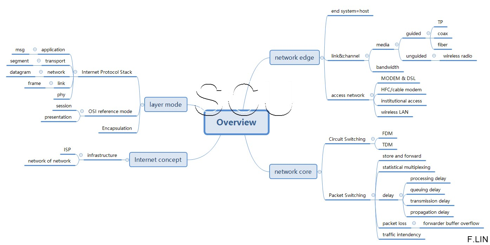
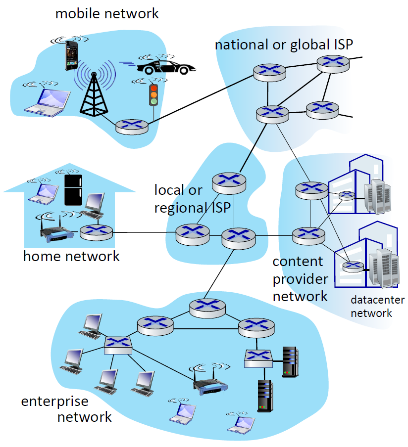
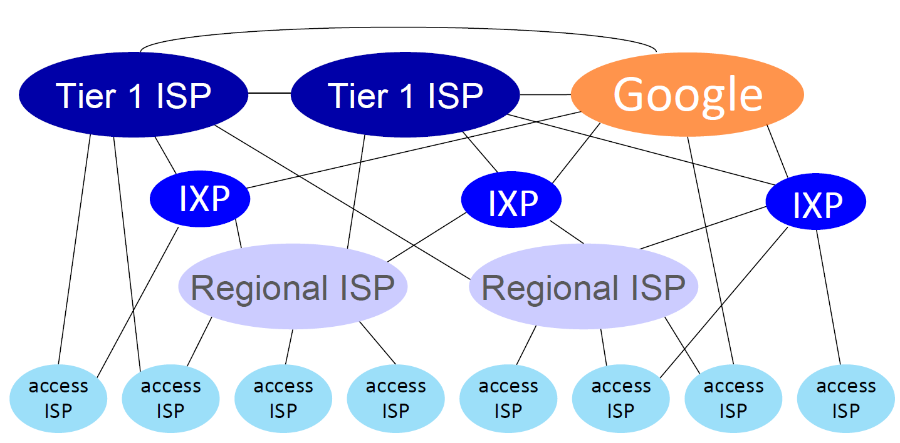
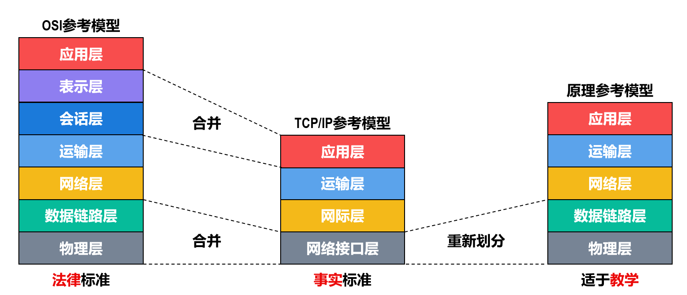
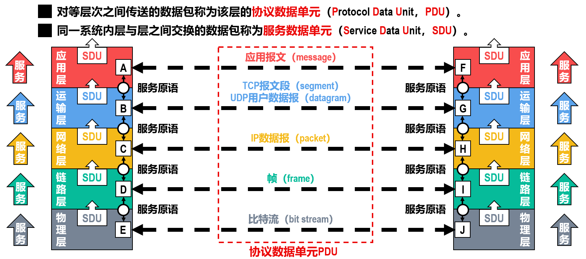

> 计算机网络主要是由一些通用的、可编程的硬件互连而成的，而这些硬件并非专门用来实现某一特定目的（例如，传送数据或视频信号）。这些可编程的硬件能够用来传送多种不同类型的数据，支持广泛的和日益增长的应用。

## 互连网 internet

> [!info] “网络的网络”
>  若干节点和链路互联形成**网络**
>  
>  若干网络通过路由器互联形成**互连网**
>  
>  **因特网**是世界上最大的互连网

主要由硬件、软件、协议组成
- ==硬件==：主机（端系统）、通信链路（双绞线）、交换设备（路由器、交换机）、通信处理器（网卡）
- ==软件==：工具软件包括E-mail程序、FTP程序
- ==协议==：由RPC定义的协议栈

********

## 因特网 Internet

因特网已发展成为**基于ISP的多层次结构**的互连网络。

### 交换

[交换](交换.md)

其它：
运行在不同==主机==的进程==通过跨越计算机网络==交换== ==报文==而相互通信。
发起通信的进程是客户端，在会话开始后等待联系的是服务器。
进程通过套接字向网络传输报文。
主机的网络接口（网卡）由IP地址标识；每一个IP地址只与网卡的接口绑定。
进程由端口号标识；每一个端口号绑定至多一个进程，同一个进程可以绑定多个端口。

## 性能度量指标

1. 速率：**数据传输速率** bits/s (bps) 
	Kbps、Mbps、Gbps、Tbps以$10^3$进制 （数据单位以 $2^{10}$ 进制）
2. 带宽：**链路最高传输速率** bits/s (bps) 或 Hz
	 是以下速率的==最小值==：主机接口速率，线路带宽，交换机或路由器的接口速率 
3. 吞吐量：**单位时间内通过某个网络或接口的实际数据量** bits/s (bps)
4. [时延](交换.md#^6362da)
5. 时延带宽积：**传播时延和带宽的乘积** 代表链路此时存在多少比特
6. 往返时间（RTT）：发送端发送报文开始，接收端收到并返回确认报文，直至发送端收到确认报文为止的时间。
7. 信道利用率：有数据通过的时间 / 总时间，==利用率越高排队时延越大==
8. 丢包率

## 体系结构与协议栈

| 层次  | 关注点                                                                                                                                        |
| --- | ------------------------------------------------------------------------------------------------------------------------------------------ |
| 应用层 | 通过应用进程间的交互来完成特定的**网络应用**； **会话**的管理与数据的**表示**；                                                                                          |
| 运输层 | 进程之间基于网络的通信、**进程的标识**； **可靠传输**与不可靠传输； **流量控制**； ==**拥塞控制**==；                                                                    |
| 网络层 | 标识网络和网络中的各主机：IP由网络号和主机号共同构成； 控制平面：==**路由选择**==； 数据平面：==**分组转发**==；                                                                   |
| 链路层 | 主机编址：**MAC地址**标识网络中各主机； **数据封装**：从比特流中区分地址和数据； **媒体接入控制**：协调主机竞争总线； 以太网交换机：**自学习和转发帧**； **差错控制**：误码检测； 可靠传输与不可靠传输； 流量控制； |
| 物理层 | 采用哪种物理介质传输信号； 采用哪种物理接口（RJ-45）； 采用哪种信号形式传输比特流；                                                                                        |

- 实体：任何可发送可接收消息的软硬件
- 对等实体：在同一层次的实体
- 协议：对等实体在同一层次进行逻辑通信的==规则==的集合
	- ==语法==：定义数据和控制信息的**格式**，如TCP请求报文段格式
	- ==语义==：如何发出控制信息、如何完成**动作及应答**，如三次握手操作
	- ==同步==：执行操作的顺序，如三次握手的**时序关系**
- 服务：对等实体同一层次进行逻辑通信**向更高层次提供服务**

这种层次对应软件工程哲学“高内聚、低耦合”，下层向上层提供服务但不依赖于下层特定的协议。

服务访问点：同一节点内相邻两层实体交换信息的逻辑接口，目的是在解封装的时候，识别上层协议，为上层提供服务。
- 链路层：帧的“类型”字段
- 网络层：数据报的“协议”字段
- 传输层：报文段的[端口号](传输层.md#^21c76f)字段
- 应用层：用户界面

==分组的封装和解封装：==未添加本层“首部”的称为SDU，已添加的称为PDU

