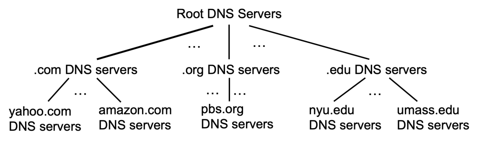
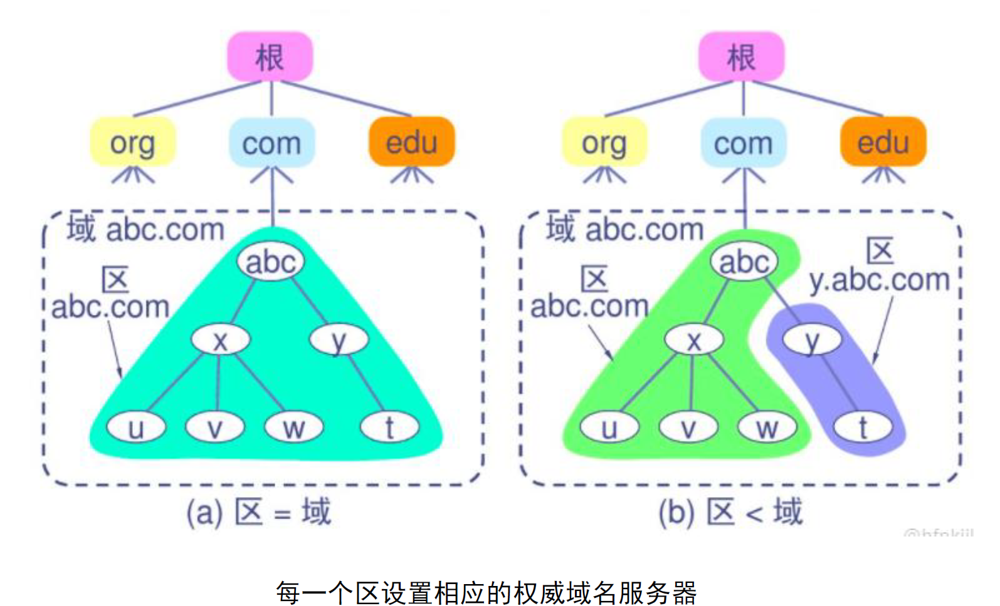
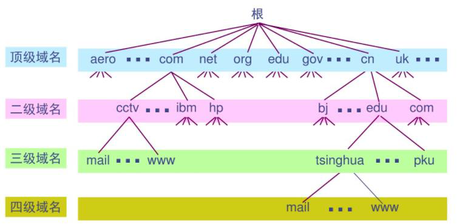

---
aliases:
  - Domain Name System
---
# DNS提供的服务

> 提供主机名到IP地址转换的目录服务；提供主机别名、邮件服务器别名服务；实现负载均衡。

位于应用层。

端口号：53.

# DNS架构

采用分布式、分层架构。
原因（为什么不采用集中式DNS）：
- 单点故障导致因特网崩溃
- 通信容量受限，存在瓶颈
- 严重时延
- 维护不便

分层架构：
- 根DNS服务器
- 顶级域名DNS服务器
- 权威域名DNS服务器
- 本地DNS服务器

---

每一层DNS服务器用来解析对应域名层级：
- 根域名DNS服务器提供顶级域名对应的顶级域名服务器IP地址
- 顶级域名DNS服务器提供二级域名对应的权威DNS服务器IP地址
- 权威域名DNS服务器提供对域名的解析服务
- 本地DNS服务器提供代理和缓存

## DNS报文

查询报文和应答报文格式：

资源记录(Resource Record, RR)：主机名到IP地址的映射
四元组：(Name, Value, Type, TTL)
TTL(Time to Live)是记录的生存时间
- Type为A，则Name是主机名，Value是主机名对应的IP地址；目的是提供主机名到IPv4地址的映射。
- Type为NS，则Name是要委派的域名，Value是该委派域名的权威DNS服务器；目的是放在上级DNS服务器用来连通查询链，告知此域名是被该权威DNS服务器所解析。
- Type为CNAME，则Name是别名，Value是主机的规范主机名。
- Type为MX，则Name是邮件服务器别名，Value是邮件服务器的规范主机名。

# DNS工作原理

权威应答：当响应来自于对查询域名所在 DNS 区拥有直接管理权限的权威域名服务器，且该服务器持有该区的最新资源记录RR，响应中 AA （Authoritative Answer）标志位被置位为 1

非权威应答：当响应来自不对目标域名区负责、仅为缓存或中继的服务器，响应中 AA 标志位为 0

在客户端到本地DNS服务器间使用递归查询，以本地DNS服务器作为代理进行迭代查询。

完整流程：
1. 浏览器的缓存查询
2. 操作系统的缓存查询
3. 本地hosts文件的缓存查询
4. 生成DNS请求报文，包括域名和类型
5. 发送至本地DNS服务器查询缓存
6. 由本地DNS服务器作为代理，向根域名服务器查询顶级域名对应的顶级域名服务器IP地址
7. 根据顶级域名服务器IP地址，向顶级域名服务器查询二级域名对应的权威DNS服务器IP地址
8. 根据权威DNS服务器IP地址，向权威DNS服务器查询所查询域名对应的IP地址
9. 本地DNS服务器对该RR进行缓存
10. 本地DNS服务器返回客户端所查询域名对应的IP地址
11. 操作系统、浏览器对RR进行缓存
12. 浏览器进程得到域名对应的IP地址