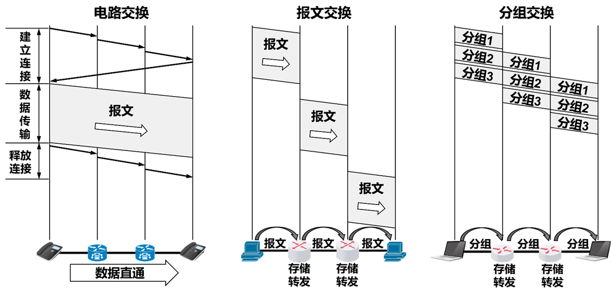
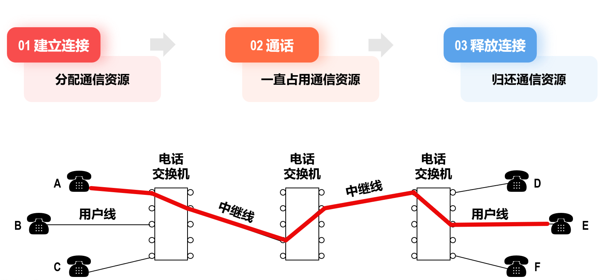
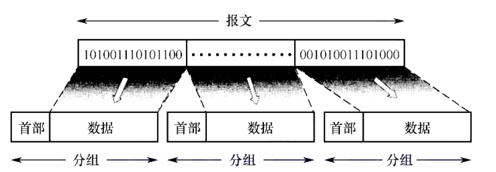

> [!note] 交换定义
>  端系统彼此交换数据，数据从源 路由 并 转发 到目标。

| 交换   | 优点                                        | 缺点                                                            |
| ---- | ----------------------------------------- | ------------------------------------------------------------- |
| 电路交换 | 通信时延小、速率高 有序数据交付 没有信道冲突 **实时性高** | **建立连接时间长** **链路利用率低** **单点故障** 没有差错控制 扩展性和弹性差    |
| 报文交换 | 无建立连接时延 灵活分配线路 链路利用率高 支持差错控制     | ==存储转发时延== 缓存开销大 **差错控制**低效（重传报文耗费时间长）                  |
| 分组交换 | 缓存开销小 降低出错概率和重传代价 **流水线**传输效率高      | ==存储转发时延== 额外传输多的**分组控制信息** ==**存在失序、丢包、重复分组、拥塞**==  |

## 电路交换

> 在传输数据之前，先在通信双方之间通过一系列交换节点建立一条**独占的物理通信链路**，连接期间发送方在该网络链路以恒定速率向接收方传输，直到通信结束后才释放该路径。会话共享同一个链路与带宽。
 

# 分组交换

> 端系统相互交换报文，将报文划分为较小的等长数据分组，==每个分组携带必要控制信息（首部）==，独立转发，每个分组**以链路最大传输速率传输**。

**首部**：源地址、目的地址、编号等控制信息

**存储转发机制**：分组交换机在接收到完整的分组后才能转发。

分组交换端到端时延： ^6362da

- 节点处理时延：检查分组首部、校验和导向正确“出口”
- 排队时延：因为分组到达速率大于传输速率而产生，流量强度大时产生拥塞，严重时缓存区满则丢弃分组。
	*因为排队时延随时间变化，分组发送到路由器n的RTT可能长于发送到路由器n+1*
- 传输时延(*Transmission Delay*)：将分组的所有比特推向链路的时间，分组长度(bits) / 链路传输速率(bps)
-  **传播时延(*Propagation Delay*)**：一个比特被推到链路后到下一个路由器经过的时间，链路长度(m) / 信号传播速率(m/s)