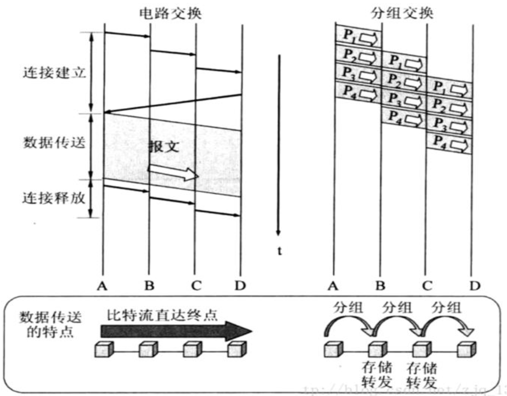
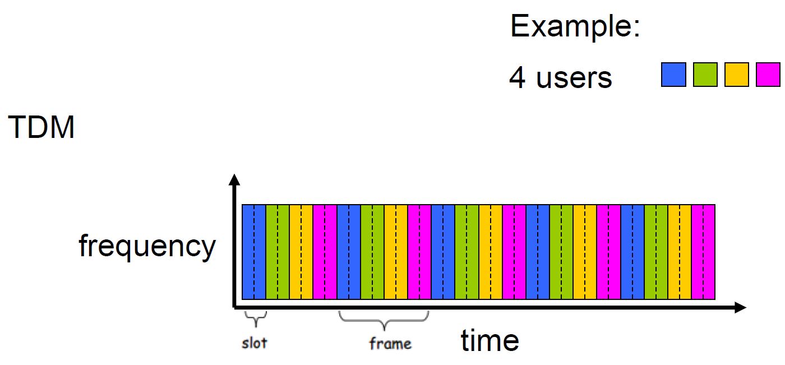
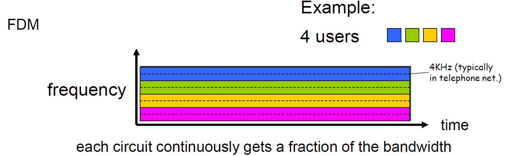
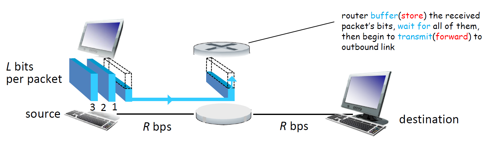
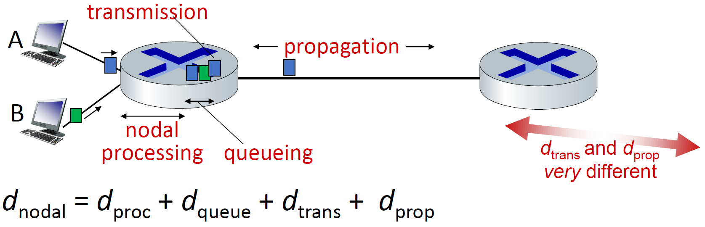

>端系统彼此交换报文，从源到目标，路由并转发。

# 电路交换

> 在传输数据之前，先在通信双方之间通过一系列交换节点建立一条独占的物理通信链路，连接期间发送方在该网络链路以恒定速率向接收方传输，直到通信结束后才释放该路径。会话共享同一个链路与带宽。

- 适用于：实时服务，如传统电话网络
- 优点：传输时延小、顺序有保证且冲突低
- 缺点：但即使空闲也独占资源，效率较低

## 复用

目的：为了在有限的传输介质或带宽上，将多个通信会话合并成一个复合信号进行传输，以**提高资源利用率**、**降低建设成本** 和 **简化网络管理**。

时分复用：每条电路在时隙中周期性得到所有带宽

频分复用：每个电路专用一个频段，连续地得到部分带宽

# 分组交换

> 端系统相互交换报文，将报文划分为较小的等长数据分组，每个分组携带必要控制信息，独立转发，每个分组以链路最大传输速率传输。

| 分组交换分类 | 定义                          | 优点                                    | 缺点          |
| ------ | --------------------------- | ------------------------------------- | ----------- |
| 数据报交换  | 每个分组独立路由、转发，无需建立连接。         | 带宽共享能力强，简单，高效，开销低，能处理突发数据流，允许更多用户使用网络 | 有不可预测的延迟与丢包 |
| 虚电路交换  | 在发送分组前需先建立逻辑连接，后续分组沿同一路径转发。 |                                       |             |

存储转发机制：分组交换机在接收到完整的分组后才能转发。

分组交换端到端时延：

- 节点处理时延：检查分组首部、校验和导向正确“出口”
- 排队时延：因为分组到达速率大于传输速率而产生，流量强度大时产生拥塞，严重时缓存区满则丢弃分组。
	*因为排队时延随时间变化，分组发送到路由器n的RTT可能长于发送到路由器n+1*
- 传输时延(Transmission Delay)：将分组的所有比特推向链路的时间，分组长度(bits)/链路传输速率(bps)
-  **传播时延(Propagation Delay)**：一个比特被推到链路后到下一个路由器经过的时间，取决于物理媒介和路由器之间距离