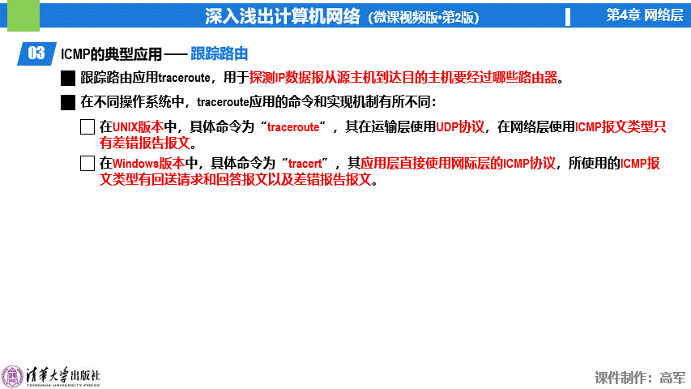

目的：为了更有效地转发IP数据报以及提高IP数据报交付成功的机会

基于IP协议，即封装在IP数据包中发送

报文分类：差错报告报文、询问报文

差错报告报文：用来向主机或路由器报告差错情况
- 终点不可达：路由器或主机不能交付IP数据报，就向源主机发送终点不可达报文
- 源点抑制：路由器或主机因拥塞丢弃IP数据报，就向源主机发送源点抑制报文
- 超时：路由器收到TTL=1的IP数据报丢弃后，就向源主机发送超时报文
- 参数问题：路由器或主机收到首部出现不正确的字段丢弃后，就向源主机发送参数问题报文
- 重定向（路由改变）：路由器通报重定向报文，以让主机知道下次发送IP数据报应通过重定向后的新路由器，以更好地到达目的主机

询问报文：用来向主机或路由器询问情况
- 回送请求和应答：测试目的主机是否可达
- 时间戳请求和应答：进行时钟同步与测量时间

应用：
- Ping：测试主机或路由器间的连通性，采用回送请求和应答报文
- Traceroute：测试主机与目的主机之间经过的路由及时间，使用回送请求和应答报文和差错报告报文（超时）。

