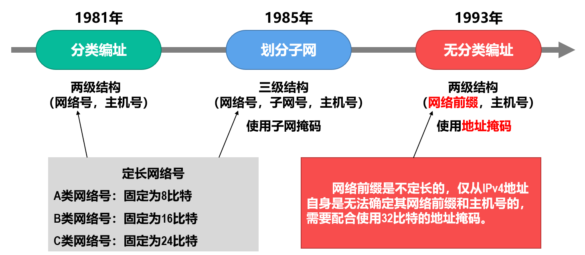
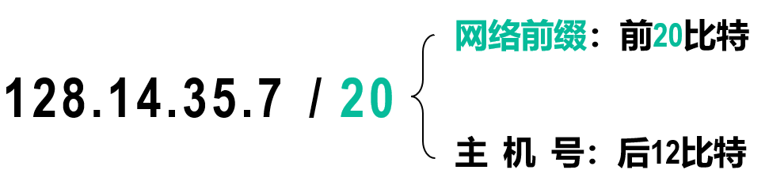
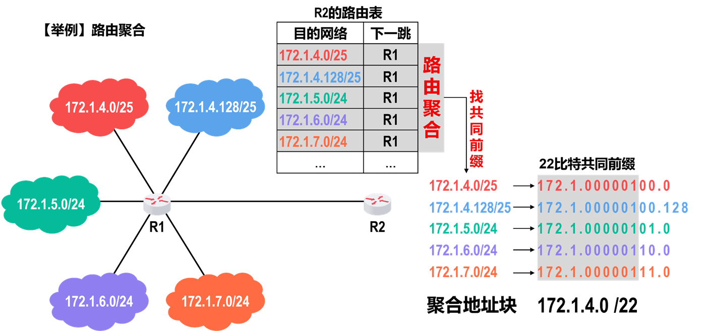

## IP地址

IP地址分类方法的演化：

每个节点的每个**接口**都有一个IP地址

IP地址一共32比特，采用点分十进制方式表示：

IP地址由网络号和主机号组成，**网络号标识该节点接口接入的网络**，**主机号标识该节点的接口**。同一个网络下的接口具有相同的网络号，具有不同的主机号。

子网掩码（地址掩码）：一共32比特，左起连续多个1（标识网络号），后面接连续多个0（标识主机号）

将IP地址与子网掩码进行**按位与**，可得到网络前缀，即==子网的网络地址==

网络前缀通常用==无分类编址==：

无分类编制可以得到该子网的地址数量、最小地址、最大地址、地址掩码。

### 特殊IP地址

- **默认地址**：0.0.0.0/0
- **全局广播地址**：255.255.255.255/32
- **回环地址**：127.0.0.0/8
- 自动配置地址：169.254.0.0/16
- E类地址（240.0.0.0 ~ 255.255.255.254）：保留地址
- 私有地址：10.0.0.0/8，172.16.0.0/12，192.168.0.0/16
- **网络地址：主机号全0**
- **本地广播地址：主机号全1**

### 路由聚合

==最长相同前缀进行路由聚合==

### IP地址分配

假设下现在需要分配IP地址：218.75.230.0/24

1. 首先计算有多少个子网
2. 每个子网下所需要的地址数 = 主机接口数+路由器接口（一般是1个）+ 网络地址（一个）+ 广播地址（一个）
3. 计算$2^n>子网所需IP地址数$ 其中n是满足该式成立的最小整数
4. n就是主机号的主机号的位数，则网络号前缀位数为 32-n
5. **按照所需分配的地址数从大往小分配**，即优先分配拥有IP地址数多的子网

## IP数据报格式

 

- 版本：IPv4还是IPv6
- **首部长度：以4字节为单位** 最小0101（20字节），最大1111（60字节）
- 可选字段：最大40字节可变长度，填充全0以保证可选字段是4字节整数倍
- 区分服务；
- 总长度：**以字节为单位**，最大长度65535（$2^{16}-1$）字节
- 标识：用于数据报分片，同一个数据报的所有分片具有相同标识
- 标志：最低位MF，置位1表示此分片后还有分片，0表示这是该数据报最后一个分片；中间位DF，置位1表示不允许分片，0表示允许分片。最高位为0
- 片偏移：**以8字节为单位**，表示该分片的==数据载荷==偏移数据报数据载荷起始位置有多远
- 生存时间（TTL）：**以“跳数”为单位**，每当路由器收到该IP数据报就减1，减到0就丢弃，以防止路由环路消耗网络资源
- 协议：指明数据载荷是哪种协议的PDU，例如TCP、UDP
- [校验和](IPv4.md#^2bedbd)

### 数据报分片

MTU：最大传输单元，即链路层帧能携带的**最大IP数据报文长度**（包含IP首部和传输层首部），每种链路所定义的MTU不同。
MSS：最大报文段长度，即传输层能携带的**最大应用层数据长度**

数据报会依据接下来的链路进行分片，如果经过一个节点（如路由器）连接的链路小于该分片，那么将继续细分分片。

### 数据报首部校验和

^2bedbd

> 首部逐比特**逻辑和**，存在进位。如果进位溢出，则**回卷**（即加1在末尾），最后**取反**得到校验和。接收方只需要再算一遍并加上校验和的首部后得到**0xFF**，证明校验成功。

相比于循环冗余校验，其速度快，但只能检出1位错误以及部分2位错误。

运行IPv4的每个路由器都会重新校验该校验和，但IPv6因为网际层不提供可靠服务，不再计算校验和。