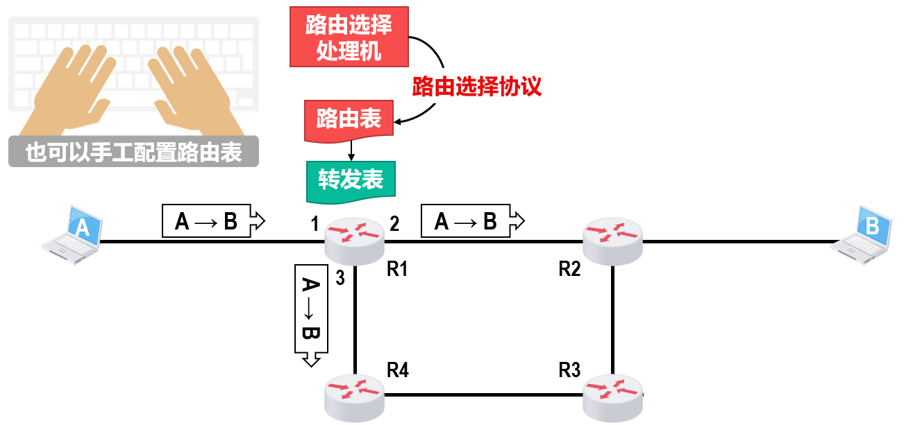

> [!note] 功能与服务
> 实现**主机与主机**间的通信
> 
> **控制平面的路由选择**与**数据平面的分组转发**
> 
> 向上提供==**简单灵活无连接不可靠的数据报服务**==，强调可靠通信应由用户主机提供

> 网际协议IP将异构网络（不同的网络接入、不同的服务、不同的差错处理、不同的路由选择、不同的最大分组长度、不同的寻址方案）相互连接，因此 **Everything Over IP, IP Over Everything.**

## IP数据报的发送和转发

这里需要引用以太网交换机自学习、转发帧机制，以及ARP获取目标主机MAC地址过程。

主机发送IP数据报：

**判断是否在同一个网络**（与子网掩码按位与判断网络号是否一致）
	1.  在同一个网络，则直接交付
	2. 不在同一个网络，则发送到默认网关

路由器转发IP数据报：

路由器收到正确的IP数据报，基于目的地址在路由表中进行**最长前缀匹配**，如果找到匹配的路由，则向下一跳接口进行转发。没有找到则丢弃，并向源主机发送差错报告

